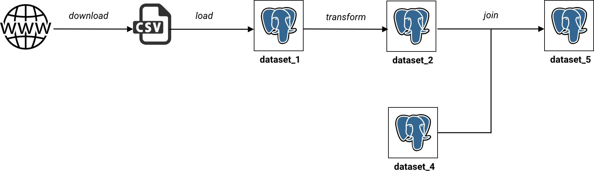

# data-preparation-plugin
Airflow plugin with database hooks and operators for common data preparation tasks

## Data preparation

Most data preparation jobs can be seen as direct acyclic graph (DAG) of tasks where tasks can be of
different sorts:

* downloading data from web urls into local filesystem
* loading files from local filesystem into a PostgreSQL table
* transforming data using Python or SQL functions:
  * filtering
  * calculating new columns
  * formatting columns
  * regex extraction
  * ...
* joining tables together




This plugin offers differents hooks and operators on top of Apache Airflow that makes this work easier.

## Hooks

In Airflow, hooks are any kind of interface to external platforms and databases.

### PostgresDataset

#### Definition

This plugin defines a hook called `PostgresDataset` to interact with a PostgreSQL table in different ways:

* read the schema of a dataset
* read a dataset as Pandas dataframe
* read a dataset row by row
* write the schema of a dataset
* write a Pandas dataframe to a dataset
* write to a dataset row by row
* reflect the content of a dataset into an SQL Alchemy mapper class

This last piece (reflection) is really useful when you want to use the ORM without declaring all fields explicitly

Reading and writing schema can be used to derive the schema of an output dataset from the schema of an input dataset in a transformation step. It makes everything DRY (don't repeat yourself). We only need to declare the schema of the first dataset explicitly.

#### Examples

*Transform a dataset using Pandas*

```python

conn_id = "my_conn_id"
schema = "my_schema"

# Input dataset
dataset_1 = PostgresDataset(
  name="table_1",
  schema=schema,
  postgres_conn_id=conn_id)

# Output dataset
dataset_2 = PostgresDataset(
  name="table_2",
  schema=schema,
  postgres_conn_id=conn_id)

# read dataset_1 into a Pandas dataframe
df = dataset_1.get_dataframe()

# apply some transformation like adding a column
df["column_3"] = df["column_1"] + df["column_2"]

# read schema of input dataset
dtype = dataset_1.read_dtype()
column_3 = Column("column_3", Integer())

output_dtype = [*dtype, column_3]

# write dataframe with dtype
dataset_2.write_from_dataframe(
  df,
  dtype=output_dtype)
```

*Transform a dataset using plain Python*
```python
conn_id = "my_conn_id"
schema = "my_schema"

# Input dataset
dataset_1 = PostgresDataset(
  name="table_1",
  schema=schema,
  postgres_conn_id=conn_id)

# Output dataset
dataset_2 = PostgresDataset(
  name="table_2",
  schema=schema,
  postgres_conn_id=conn_id)

# keep onlu those columns, discarding others
keep = ["column_1", "column_2"]

# transform schema
dtype = dataset_1.read_dtype()
output_dtype = [
  column for column
  in dtype if column.name
  in keep]

# write schema
dataset_2.write_dtype(output_dtype)

# write data
with dataset_2.get_writer() as writer:
  for row in dataset_1.iter_rows()
    output_row = dict(
      (column, row[column])
      for column in row
      if column in keep)
    writer.write_row_dict(output_row)
```


*Use reflection and SQLAlchemy to perform a join*
```python

conn_id = "my_conn_id"
schema = "my_schema"

# Input datasets
dataset_1 = PostgresDataset(
  name="table_1",
  schema=schema,
  postgres_conn_id=conn_id)

dataset_2 = PostgresDataset(
  name="table_2",
  schema=schema,
  postgres_conn_id=conn_id)

# Output dataset
dataset_3 = PostgresDataset(
  name="table_3",
  schema=schema,
  postgres_conn_id=conn_id)

# Write output schema
dtype = [*dataset_1.read_dtype(), *dataset_2.read_dtype()]
dtype = merge_dtype(dtype)

dataset_3.write_schema(dtype)

# Reflect input datasets to get ORM Mappers
Dataset1 = dataset_1.reflect()
Dataset2 = dataset_2.reflect()

# Perform a join
session = dataset_1.get_session()
q = session \
  .query(Dataset1, Dataset2)
  .join(Dataset2, Dataset1.id == Dataset2.id)
  .all()

# Write records to output dataset
with dataset_3.get_writer() as writer:
  for (row1, row2) in q:
    output_row = {**row2dict(row1), **row2dict(row2)}
    writer.write_row_dict(output_row)
```

## Operators

### EmbulkOperator

TODO

### DownloadUnzipOperator

TODO

## Run the tests

Create a virtualenv and install dependencies

```
pip install -r requirements.txt
```

Initialize Airflow metastore

```
airflow initdb
```

Launch a local PostgreSQL instance

```
docker run -p 5432:5432 postgres:9.6
```

Run the tests

```
python -m unittest
```

